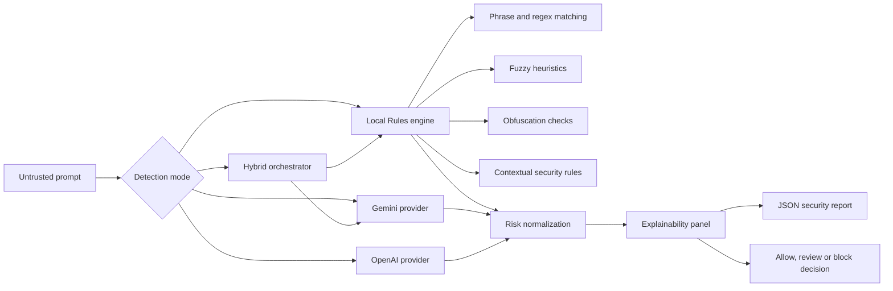

# PromptShield — AI Prompt Attack Detector

PromptShield is an explainable security classifier that detects prompt injection, instruction overrides, jailbreak attempts, phishing intent, safety bypasses, hidden prompt extraction and other suspicious manipulation before untrusted text reaches an AI model.

The project combines a deterministic local rules engine with optional Gemini and OpenAI providers. Its hybrid mode compares both engines and applies a conservative final security verdict.

## Key features

- Local detection without an API key
- Weighted phrase and regular expression rules
- Contextual instruction-override detection
- Fuzzy semantic heuristics
- Obfuscation checks
- Phishing and credential-theft intent detection
- Gemini API integration
- Optional OpenAI integration
- Hybrid Rules + AI analysis
- Automatic fallback when an AI provider is unavailable
- Explainability panel
- Engine agreement and disagreement reporting
- Normalized risk scoring from 0 to 100
- JSON-compatible results
- Downloadable JSON security reports
- Streamlit security dashboard
- Docker support and container health checks
- Automated Python and Docker CI checks

## Detection modes

| Mode | Description | API key |
|---|---|---:|
| Rules | Deterministic local rules, regex, fuzzy and obfuscation checks | No |
| Gemini AI | Semantic analysis performed by Gemini | Yes |
| OpenAI | Optional OpenAI semantic analysis | Yes |
| Hybrid | Local Rules and Gemini with a conservative combined verdict | Gemini key recommended |

Rules mode works completely offline and remains available when external providers fail.

## Architecture



## Risk model

PromptShield uses a normalized risk score from `0` to `100`.

| Score | Risk level | Suggested action |
|---:|---|---|
| 0–24 | LOW | Allow |
| 25–49 | MEDIUM | Process with caution |
| 50–74 | HIGH | Review or block |
| 75–100 | CRITICAL | Block |

The Rules engine avoids blindly adding every match. It groups matches by category, uses the strongest signal from each category and increases risk when dangerous category combinations occur.

For example, an instruction override combined with phishing intent receives a higher score than either signal alone.

## Hybrid decision strategy

Hybrid mode runs the local Rules engine and an AI provider independently.

The final result:

1. Preserves both engine reports.
2. Displays their explanations separately.
3. Reports whether the engines agree.
4. Uses the more cautious risk assessment.
5. Falls back to local Rules if the AI provider is unavailable.

This design ensures that the application remains useful without paid API access or network connectivity.

## Technology stack

- Python 3.13
- Streamlit
- Python `unittest`
- Regular expressions
- Fuzzy matching heuristics
- Gemini API
- OpenAI-compatible API client
- Docker
- GitHub Actions

## Project structure

```text
ai-prompt-attack-detector/
├── .github/
│   └── workflows/
│       └── ci.yml
├── detectors/
│   ├── __init__.py
│   ├── ai_common.py
│   ├── gemini_detector.py
│   ├── openai_detector.py
│   ├── rule_based.py
│   └── rules_database.py
├── reports/
│   ├── __init__.py
│   ├── console_report.py
│   └── json_report.py
├── tests/
│   ├── test_ai_common.py
│   └── test_rule_based.py
├── .dockerignore
├── .env.example
├── .gitignore
├── app.py
├── config.py
├── Dockerfile
├── main.py
├── README.md
└── requirements.txt
```

## Local installation

Clone the repository and enter its directory:

```bash
git clone https://github.com/jsi3r3k/ai-prompt-attack-detector.git
cd ai-prompt-attack-detector
```

Create a virtual environment:

```bash
python3 -m venv .venv
source .venv/bin/activate
```

Install dependencies:

```bash
python3 -m pip install --upgrade pip
python3 -m pip install -r requirements.txt
```

Create local configuration:

```bash
cp .env.example .env
```

Rules mode does not require any API keys.

Start the application:

```bash
python3 -m streamlit run app.py
```

Open:

```text
http://localhost:8501
```

## Environment configuration

Example `.env`:

```env
DEFAULT_DETECTION_METHOD=rules

GEMINI_API_KEY=
GEMINI_MODEL=

OPENAI_API_KEY=
OPENAI_MODEL=
```

Never commit `.env` or API keys to version control.

The application loads configuration from `.env`, while `.env.example` documents the available variables without exposing secrets.

## Running tests

```bash
python3 -m unittest discover -s tests -v
```

The tests include:

- safe prompt classification
- direct instruction override detection
- contextual override detection
- phishing intent detection
- false-positive protection for phishing-awareness questions
- fuzzy matching
- obfuscation detection
- AI score normalization
- risk-level calibration

## Docker

Build the image:

```bash
docker build \
  --tag ai-prompt-attack-detector:1.0 \
  .
```

Run without an external AI provider:

```bash
docker run \
  --rm \
  --name prompt-attack-detector \
  --publish 127.0.0.1:8501:8501 \
  ai-prompt-attack-detector:1.0
```

Run with environment configuration:

```bash
docker run \
  --rm \
  --name prompt-attack-detector \
  --env-file .env \
  --publish 127.0.0.1:8501:8501 \
  ai-prompt-attack-detector:1.0
```

Check the container:

```bash
docker ps
```

Inspect its health:

```bash
docker inspect \
  --format='{{json .State.Health}}' \
  prompt-attack-detector
```

## Continuous integration

The GitHub Actions workflow automatically:

1. Checks out the repository.
2. Installs Python and dependencies.
3. Runs all unit tests.
4. Builds the Docker image.
5. Starts a temporary container.
6. Checks the Streamlit health endpoint.
7. Removes the test container.

The CI workflow does not require Gemini or OpenAI secrets because the application supports local Rules mode.

## Example security result

```json
{
  "status": "completed",
  "is_attack": true,
  "risk_score": 90,
  "risk_level": "CRITICAL",
  "categories": [
    "instruction_override",
    "social_engineering"
  ],
  "safe_to_process": false,
  "detection_method": "hybrid_rules_and_gemini",
  "decision_strategy": "maximum_risk_score"
}
```

## Security and privacy

Rules mode processes prompts locally and does not send their content to an external provider.

Gemini and OpenAI modes send the analyzed prompt to the selected provider. Users should avoid submitting secrets, credentials or private data unless their provider configuration and data-handling policy are appropriate for the use case.

API keys are read from environment variables and are not included in generated reports.

## Limitations

PromptShield is a portfolio and educational security project. It should not be treated as a complete replacement for production AI security controls.

Important limitations include:

- Rule-based detection may produce false positives or false negatives.
- AI provider results may vary between requests and model versions.
- Obfuscated or multilingual attacks may require additional rules.
- A prompt can be malicious without using known attack phrases.
- External provider availability and rate limits can affect AI modes.
- Security decisions should use multiple layers of protection.

In production, this detector should be combined with authentication, authorization, input limits, output filtering, audit logs, rate limiting and model-provider security controls.

## Roadmap

- Multilingual attack patterns
- REST API
- Batch prompt analysis
- Detection history dashboard
- CSV and PDF reports
- Provider mocking for integration tests
- Performance benchmarks
- Custom rule configuration
- Rule versioning
- Published Docker image
- Cloud deployment

## Why this project exists

Prompt injection is an application-security problem, not only a model problem.

PromptShield demonstrates how deterministic detection, semantic AI analysis, graceful fallback, explainability, testing and containerization can be combined into one practical security tool.